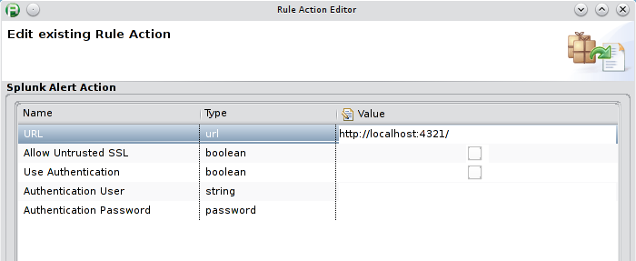

dynatrace App for Splunk
=========================

This Application enables a seamless way to store Business Transactions and Alerts in Splunk for further analysis by correlating your Splunk data with dynatrace Business Transaction data.

  * Zero Configuration with out-of-the-box 

  * Stream real-time Business Transaction data to [Splunk](http://www.splunk.com)

    * All transactions 24/7 

    * End User Perspective 

    * Discrete Business aware transactions 

  * Push Baseline violations, smart alerts & application exceptions to [Splunk](http://www.splunk.com)

  * Push Application, Business Transaction and Infrastructure metrics to [Splunk](http://www.splunk.com)

  * Launch the Dynatrace client for a single transactions and alerts from within [Splunk](http://www.splunk.com)

  * Drill-down to root-cause, export & share with your team 

## Library Details

| Name | dynatrace Splunk Application
| :--- | :---
| Supported dynaTrace Versions | >= 5.5
| Authors |Rajesh Jain (Owner) 
|| Michael Kopp
|| Yiaochung Lee and Wilson Lai (initial splunk application) ,
|| Ardeshir Arfaian (initial splunk alert),
|| Peter Kaiser ([Big Data Business Transaction Bridge](https://community.compuwareapm.com/community/display/DL/Big+Data+Business+Transaction+Bridge) used internally by the Splunk Application)
| License | [dynatrace BSD](dynaTraceBSD.txt)
| Support [Not Supported ](https://community.compuwareapm.com/community/display/DL/Support+Levels#SupportLevels-Community)
| Release history | Version 2.1
| Download | [dynaTrace App for Splunk](APM_dynatrace.tar.gz)
| | [DynaTrace Splunk Alert Plugin](com.compuware.splunkintegration_1.0.0.jar)
| | [Splunk Business Transactions template profile](dSplunk%20Business%20Transactions.profile.xml)

## Release Notes v 2.1

In this release we have changed the startup script of flume server and the input scripts for Splunk. We use python scripts which are platform independent. You will see only three scripts runFlume.py,
runDashboard.py and cleanFlume.py in this version which replaces all the previous bat/sh/curl scripts and processes

In case you are using the Google Maps Plugin, there are some config / permission issues with the GeoLiteData.dat file which may not allow you to use the maps view with this app. But you can install
the Google Maps Plugin and search within that App context for dynaTrace visits.

## Release Notes v 2.0

The dynaTrace , Splunk App Version 2.0 is available on the Splunk App Store <http://apps.splunk.com/app/1593/>

V 2.0 has major changes in the OOB Dashboards which are populated with APM data from dynaTrace. Application at Glance : Gives you at glance view of the Applications, Visitors and Critical Transactions

Visitors on a Map: Gives you a geographical view of your visitors, with the ability to zero on a single visit

Key Analytic Metrics: Allows you to share analysis APM data for business analysis and effectiveness of your web/app properties

Transaction Activity Data and User Activity Data: Gives you a timeline view of your transactions, so you can understand at what time of the day certain transactions are heavily used or not.

The Splunk App also has a pivot data model to start with, which an be used to create models around User Activity, Visits and Transaction Health and leverage the Splunk platform for Analysis.The Splunk
App for Linux platform has a cleanup script to clean the log files once they have been ingested.

## Prerequisites

You will need dynaTrace 5.5 with enabled Business Transaction Export. You will also need a recent version of Splunk, this Application has been tested with Splunk 6 Windows and Linux! You Splunk box
needs to have Java 6 or higher installed.

## Quick Start Guide - Three Easy Steps

### Step 1: Install the Splunk App from the App Store

Download the APM_dynaTrace file from the attachments or from the Splunk Store <http://apps.splunk.com/app/1593/>

Open Splunk, Click on Splunk Icon -> Manage Apps and Install app from file.

### Step 2: Enable Business Transactions Feed

Open dynaTrace Client -> Server Settings -> (Export) Business Transaction Feeds

Insert the URL of the Flume (Splunk) server. The default port of the flume server running on the Splunk server is 4321

### Step 3: Export Business Transactions

Select the Business Transactions you would like to export, edit the Business Transaction and select export results.

_Good Luck, you should start seeing data in dynaTrace App for Splunk_

## Detail Setup Guide

### Install Dynatrace Splunk Application

Use the Splunk Web UI to install the APM with dynaTrace Splunk Application. You can simply install the [APM with Dynatrace Splunk App](Splunk_Application.html) as is. Once ready the app will begin
listening for data on the designated host inside 5 minutes after install.

The Splunk Application contains the [Big Data Business Transaction Bridge](https://community.compuwareapm.com/community/display/DL/Big+Data+Business+Transaction+Bridge) with a specialized flume
configuration. You can edit it by going to _$SPLUNK_HOME/etc/apps/_APM_dynatrace_/bin_. Per default it will listen on port 4321, which you can change. It will write the data to the log directory in
the application folder.

### Adapt Log directory and configure cleanup

Default directory for the log files are in _$SPLUNK_HOME/etc/apps/APM_dynatrace/log_

On Linux we have a cleanFlume.sh which cleans the log files from this location after injestion.

You can change the log directory by modifing the _flume.conf_ file in the Applications bin directory. The respective settings are

  * agent1.sinks.purepath.sink.directory 

  * agent1.sinks.pageaction.sink.directory 

  * agent1.sinks.visit.sink.directory 

  * agent1.sinks.alerts.sink.directory 

One appropriate directory on a Linux system would be _/var/log/dynatrace_. You could then use the Linux service [logrotate](http://linuxcommand.org/man_pages/logrotate8.html) with rotate option 0
(delete and not rotate) to cleanup old data on a daily or weekly basis. On A Windows system you can do something similar with a Scheduled delete of old files.

### Enable Business Transaction Feed

See [Real Time Business Transactions Feed](https://community.compuwareapm.com/community/display/DOCDT55/Real+Time+Business+Transactions+Feed) on how to enable this feature. You should set the host and
port to the host that runs the Splunk Application and use the default port 4321 unless you have changed it.

### Business Transaction Data in Splunk

#### Default Report and Business Transactions

The Splunk Application contains a Default View called "Top Countries". It shows the top converted countries, Top Landing pages and their conversion rate and the Exit Pages with conversion rates. In
order for this to work add the two Business Transactions from the [Splunk Business Transactions template profile](dist/Splunk%20Business%20Transactions.profile.xml) to your own System Profile:

  * Detailed Visit Data 

  * Detailed User Actions 

#### Enable and use Business Transactions

By simply enabling the HTTP export of any Business Transactions you can now use them in splunk. The Splunk Application distinguishes between 4 source types

  * pp - PurePath 

  * pa - PageAction (Client Action) 

  * visit - Visit 

  * alert - Alert 

you can select for them easily by using the _sourcetype=pp_ query expression in splunk

All fields are automatically discovered.

#### Searching for particular Business Transaction Splittings

In the [Export of Business Transactions](https://community.compuwareapm.com/community/display/DOCDT55/Real+Time+Business+Transactions+Feed) splittings are called dimensions. Accordingly you can search
for any dimension in splunk by filtering by the specific dimension. e.g. if you export the easyTravel Business Transaction _easyTravel Bookings by Location_ you can search for locations via an
expression like this

    
    
    sourcetype= pp AND "dimensions.Booking Location" = "*Zurich*"

You can also look at the top locations by revenue

    
    
    sourcetype= pp | stats sum(measures.Revenue)  by "dimensions.Booking Location" | rename sum(measures.Revenue) AS revenue | sort -revenue

#### Correlating Visits, ClientActions and PurePaths and Aggregating data

Splunk has a very comprehensive query language that allows many aggregations that we know from SQL and BI tools. With this you can correlate a Visit with its respective Client Actions and PurePath by
using the fields shared among them (e.g. the visitId). You can aggregate measures across different dimensions and do complex statistical analysis.

### Sending Alerts to Splunk

To send alerts to splunk you need to install the attached [Dynatrace Splunk Alert Plugin](dist/com.compuware.splunkintegration_1.0.0.jar). Once done you can use this plugin to export any alert. Simple
go to the Incident, switch to the Actions tab and click on _Advanced Configuration_. You can then add the Splunk Action as an Incident Action

Set the url to _http://<splunk_host>:4321/_. Change the host and port accordingly.  

### Pulling Measurement data into Splunk

This Splunk Application uses the [dynaTrace Server REST API](https://community.compuwareapm.com/community/pages/viewpage.action?pageId=114033234) to query dashboards and pull the measurement data from
them into Splunk. to activate this you need to edit the runDashboard.sh/.bat inside the Dynatrace Splunk Application Directory

    
    
    $SPLUNK_HOME/etc/apps/CompuwareAPM/bin/runDashboard.sh

  * Change the DTSERVER, USER and PWD variables according to your dynaTrace setup 

  * Change the DASHBOARD to the name of the dashboard you want to use. 

The script will then pull the dashboard periodically (every 5 minutes on default) and retrieve the measurement data in JSON format.

If you want to retrieve multiple dashboards or from different servers simply copy/paste the script lines that do the rest and xslt call.

### Drill down to dynaTrace

One of the features of this Splunk Application is that you can drill down from an alert or Business Transaction from Splunk into dynaTrace. In order to do this for Business Transactions you need to
enable the PurePath Data export in a particular Business Transaction.

The Splunk events will then contain the purePathId. If this is there you will be able to use the _Drill down to Dynatrace_ to open the PurePath in your local dynaTrace client. This requires that you
the client is already running and connected to the correct dynaTrace Server.

You can do the same for Alerts.

In both cases the dynaTrace client must be already running on your local machine!

## Questions & Ideas

If you have questions or ideas for this Splunk Application please post it in our [Plugin Forum](https://community.compuwareapm.com/community/display/DTFORUM/Community+Plugins+and+Extensions)

