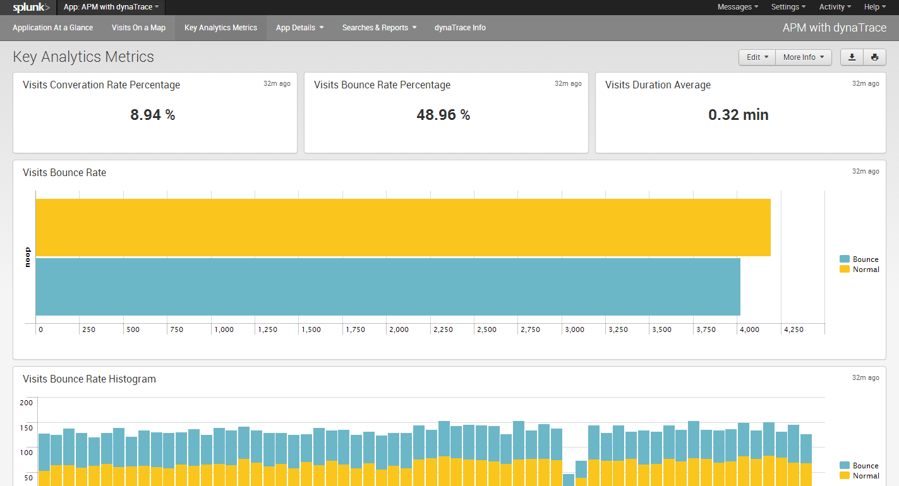

Splunk Application
=========================
<html xmlns="http://www.w3.org/1999/xhtml">
<head>
    <link type="text/css" rel="stylesheet" href="css/blueprint/liquid.css" media="screen, projection"/>
    <link type="text/css" rel="stylesheet" href="css/blueprint/print.css" media="print"/>
    <link type="text/css" rel="stylesheet" href="css/content-style.css" media="screen, projection, print"/>
    <link type="text/css" rel="stylesheet" href="css/screen.css" media="screen, projection"/>
    <link type="text/css" rel="stylesheet" href="css/print.css" media="print"/>
</head>

<body>
    

        

            

    

            
            

    

This Application enables a seamless way to store Business Transactions and Alerts in Splunk for further analysis by correlating your Splunk data with dynatrace Business Transaction data.    

<ul class=" "><li class=" ">    

Zero Configuration with out-of-the-box    

</li><li class=" ">    

Stream real-time Business Transaction data to <a href="http://www.splunk.com">Splunk</a>    

<ul class=" "><li class=" ">    

All transactions 24/7    

</li><li class=" ">    

End User Perspective    

</li><li class=" ">    

Discrete Business aware transactions    

</li></ul></li><li class=" ">    

Push Baseline violations, smart alerts &amp; application exceptions to <a href="http://www.splunk.com">Splunk</a>    

</li><li class=" ">    

Push Application, Business Transaction and Infrastructure metrics to <a href="http://www.splunk.com">Splunk</a>    

</li><li class=" ">    

Launch the Dynatrace client for a single transactions and alerts from within <a href="http://www.splunk.com">Splunk</a>    

</li><li class=" ">    

Drill-down to root-cause, export &amp; share with your team    

</li></ul>    

        <h2>Library Details</h2>

<table>
            <thead class=" "></thead><tfoot class=" "></tfoot><tbody class=" ">    
            <tr>
               <td rowspan="1" colspan="1">
Name    
</td>
               <td rowspan="1" colspan="1">
<strong class=" ">dynatrace Splunk Application</strong>    
</td>
            </tr>
            <tr>
               <td rowspan="1" colspan="1">
Version    
</td>
               <td rowspan="1" colspan="1">
2.1    
</td>
            </tr>
            <tr>
               <td rowspan="1" colspan="1">
dynaTrace Version    
</td>
               <td rowspan="1" colspan="1">
5.5+    
</td>
            
            </tr>
            <tr>
               <td rowspan="1" colspan="1">
Authors    
</td>
               <td rowspan="1" colspan="1">
                  
Rajesh Jain (Owner)

                  
Michael Kopp

                  
Yiaochung Lee and Wilson Lai (initial splunk application) ,

                  
Ardeshir Arfaian (initial splunk alert),

                  
Peter Kaiser (<a href="https://community/display/DL/Big+Data+Business+Transaction+Bridge">Big Data Business Transaction Bridge</a> used internally by the Splunk Application)    

               </td>
            </tr>
            <tr>
                <td rowspan="1" colspan="1">
License    
</td>
                <td rowspan="1" colspan="1">
<a href="attachments_5275722_2_dynaTraceBSD.txt">dynatrace BSD</a>    
   
                </td>
            </tr>
            <tr>
                <td rowspan="1" colspan="1">
Support    
</td>
                <td rowspan="1" colspan="1">
<a href="https://community/display/DL/Support+Levels#SupportLevels-Community">Not Supported </a>    

                </td>
            </tr>
            <tr>
                <td rowspan="1" colspan="1">
Contents    
</td>
                <td rowspan="1" colspan="1">
                
<a href="attachments_173801608_1_APM_dynatrace.tar.gz">dynaTrace App for Splunk</a>

                
<a href="attachments_117833759_2_com.compuware.splunkintegration_1.0.0.jar">DynaTrace Splunk Alert Plugin</a>

                
<a href="attachments_122322946_1_Splunk_Business_Transactions.profile.xml">Splunk Business Transactions template profile</a>

                </td>
            </tr>
        </tbody>        
        </table>

    

    <h2>Release Notes v 2.1</h2>
    
In this release we have changed the startup script of flume server and the input scripts for Splunk. We use python scripts which are platform independent. You will see only three scripts runFlume.py, runDashboard.py and cleanFlume.py in this version which replaces all the previous bat/sh/curl scripts and processes    

    
In case you are using the Google Maps Plugin, there are some config / permission issues with the GeoLiteData.dat file which may not allow you to use the maps view with this app. But you can install the Google Maps Plugin and search within that App context for dynaTrace visits.    

    <h2>Release Notes v 2.0    </h2>
    
The dynaTrace , Splunk App Version 2.0 is available on the Splunk App Store <a href="http://apps.splunk.com/app/1593/">http://apps.splunk.com/app/1593/</a>    

    
V 2.0 has major changes in the OOB Dashboards which are populated with APM data from dynaTrace.
    Application at Glance : Gives you at glance view of the Applications, Visitors and Critical Transactions    

    

    
Visitors on a Map: Gives you a geographical view of your visitors, with the ability to zero on a single visit

    

    
Key Analytic Metrics: Allows you to share analysis APM data for business analysis and effectiveness of your web/app properties

    

    
Transaction Activity Data and User Activity Data: Gives you a timeline view of your transactions, so you can understand at what time of the day certain transactions are heavily used or not.    

    

    
The Splunk App also has a pivot data model to start with, which an be used to create models around User Activity, Visits and Transaction Health and leverage the Splunk platform for Analysis.The Splunk App for Linux platform has a cleanup script to clean the log files once they have been ingested.

   

</body>
</html>

    <h2>Prerequisites</h2>
    
You will need dynaTrace 5.5 with enabled Business Transaction Export. You will also need a recent version of Splunk, this Application has been tested with Splunk 6 Windows and Linux! You Splunk box needs to have Java 6 or higher installed.    

    

    <h2>Quick Start Guide - Three Easy Steps</h2>

    <h3>Step 1: Install the Splunk App from the App Store</h3>
    
Download the APM_dynaTrace file from the attachments or from the Splunk Store <a href="http://apps.splunk.com/app/1593/">http://apps.splunk.com/app/1593/</a>    

    
Open Splunk, Click on Splunk Icon -&gt; Manage Apps and Install app from file.    

    <h3>Step 2: Enable Business Transactions Feed</h3>    
    
Open dynaTrace Client -&gt; Server Settings -&gt; (Export) Business Transaction Feeds    

    
Insert the URL of the Flume (Splunk) server. The default port of the flume server running on the Splunk server is 4321    

    
 

 

    
 

    <h3>Step 3: Export Business Transactions</h3>
    
Select the Business Transactions you would like to export, edit the Business Transaction and select export results.    

    

    

    

    

    
<i class=" ">Good Luck, you should start seeing data in dynaTrace App for Splunk</i>    

    

    

 

    
 

 
